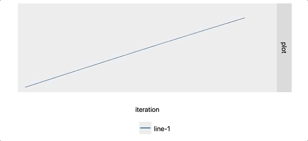
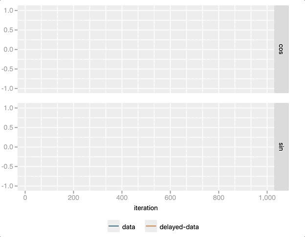
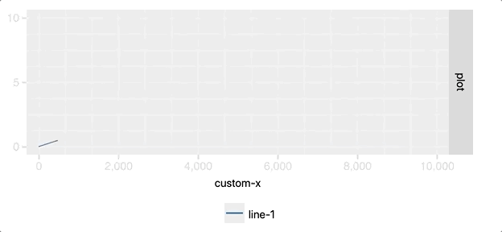

<!--

#################################################
### THIS FILE WAS AUTOGENERATED! DO NOT EDIT! ###
#################################################
# file to edit: notebooks/index.ipynb
# command to build the docs after a change: nbdev_build_docs

-->

# jupyter_plot

> Create real-time plots in Jupyter notebooks.


## What is it?

This is a library to generate real-time plots in Jupyter notebooks with a tqdm-like interface. It is largely based on the [python-lrcurve](https://github.com/AndreasMadsen/python-lrcurve) by Andreas Madsen.


## Install

`pip install jupyter_plot`

## How to use
### Single plot

Creating a simple real-time plot in a Jupyter notebook is as easy as easy as the following line:
<div class="codecell" markdown="1">
<div class="input_area" markdown="1">

```
from jupyter_plot import ProgressPlot
import numpy as np

pp = ProgressPlot()
for i in range(1000):
    pp.update(np.sin(i/100))
pp.finalize()
```

</div>

</div>



**Note:** The `pp.finalize()` statement is necessary to make the plots persistent between notebook sessions.

### Custom range
By default, the x and y range adapt to new data points. If the scale is known beforehand, it might steadier to set it beforehand:
<div class="codecell" markdown="1">
<div class="input_area" markdown="1">

```
pp = ProgressPlot(x_lim=[0,1000],y_lim=[-1.5,1.5])
for i in range(1000):
    pp.update(np.sin(i/100))
pp.finalize()
```

</div>

</div>


### Multiple lines
One can also plot several lines in parallel by specifying the line names in the constructor and passing all values in a list.
<div class="codecell" markdown="1">
<div class="input_area" markdown="1">

```
pp = ProgressPlot(line_names=['lin', 'log', 'cos', 'sin'], x_lim=[0, 1000], y_lim=[-1,4])
for i in range(1000):
    pp.update([[i/250, np.log10(i+1), np.cos(i/100), np.sin(i/100)]])
pp.finalize()
```

</div>

</div>


**Note:** The data is fed with two brackets `[[y1, y2, y3]]`. The first list corresponds the plots, wheras the second list to each line of each plot as we will also see in the next example.

### Multiple plots
<div class="codecell" markdown="1">
<div class="input_area" markdown="1">

```
pp = ProgressPlot(plot_names=['cos', 'sin'], line_names=['data', 'delayed-data'], x_lim=[0, 1000], y_lim=[-1,1])
for i in range(1000):
    pp.update([[np.cos(i/100), np.cos((i+20)/100)], [np.sin(i/100), np.sin((i+20)/100)]])
pp.finalize()
```

</div>

</div>



### Custom x-values
Finally, if the x values should not be incremented by 1 at every update one can set the `x_iterator=False`. This requires passing two values to the `update(x, y)`, where `x` is an `int`/`float` and `y` follows the same format as in the previous examples.
<div class="codecell" markdown="1">
<div class="input_area" markdown="1">

```
pp = ProgressPlot(x_iterator=False, x_label='custom-x', x_lim=[0,10000], y_lim=[0, 10])
for i in range(1000):
    pp.update(10*i, i/100)
pp.finalize()
```

</div>

</div>



## Limitations

* Only one `ProgressPlot()` object can be used at a time. 
* Each subplot must have the same number of lines and same line colors.
